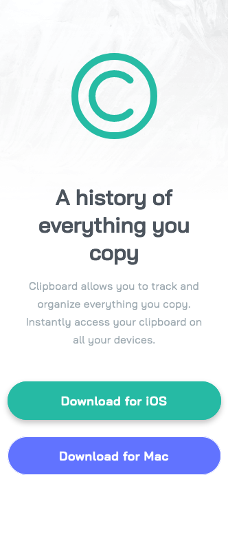

# Frontend Mentor - Clipboard landing page solution

This is a solution to the [Clipboard landing page challenge on Frontend Mentor](https://www.frontendmentor.io/challenges/clipboard-landing-page-5cc9bccd6c4c91111378ecb9). Frontend Mentor challenges help you improve your coding skills by building realistic projects.

## Table of contents

- [Overview](#overview)
  - [The challenge](#the-challenge)
  - [Screenshot](#screenshot)
  - [Links](#links)
- [My process](#my-process)
  - [Built with](#built-with)
- [Author](#author)

## Overview

### The challenge

Users should be able to:

- View the optimal layout for the site depending on their device's screen size
- See hover states for all interactive elements on the page

### Screenshot

### Links

- Solution URL: [Github](https://github.com/hirohiro2255/hirohiro2255.github.io/tree/master/frontendmentor/junior/clipboard-landing-page)
- Live Site URL: [GithubPages](https://hirohiro2255.github.io/frontendmentor/junior/clipboard-landing-page/index.html)

## My process

### Built with

- Flexbox
- CSS Grid
- Mobile-first workflow

## Author

- Website - [GithubPages](https://hirohiro2255.github.io/)
- Frontend Mentor - [@hirohiro2255](https://www.frontendmentor.io/profile/hirohiro2255)
- Twitter - [@hrkzhrn](https://www.twitter.com/hrkzhrn)
